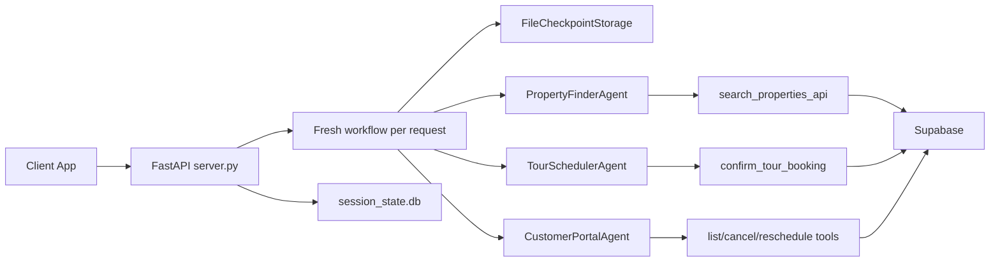
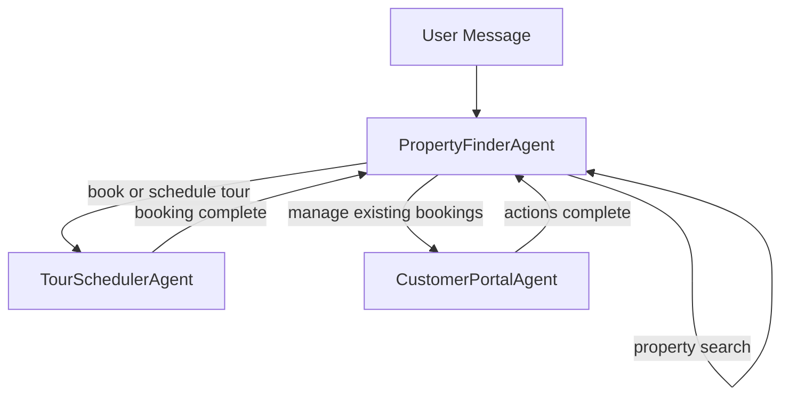
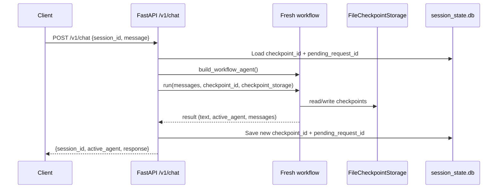

# Property Agent App

A multi-agent real estate assistant built with Microsoft Agent Framework, FastAPI, and Supabase.

It supports:

- Property discovery and filtering
- Tour booking
- Booking management (list, cancel, reschedule)
- Durable workflow resume via checkpoint storage

## Tech Stack

- Python 3.11+
- FastAPI
- Microsoft Agent Framework (`agent-framework`, `agent-framework-openai`)
- Supabase (Postgres)
- YAML-driven agent definitions
- SQLite (lightweight session metadata)

## Repository Structure

- `app.py`: Agent client/bootstrap and workflow graph factory
- `server.py`: FastAPI gateway with per-session workflow resume
- `config/*.yaml`: Agent prompts/tool contracts
- `tools/property_tools.py`: Property search tool
- `tools/scheduling_tools.py`: Booking tools
- `utils/agent_config.py`: YAML to agent builder
- `utils/logger.py`: Central logger setup
- `seeder.txt`: Supabase SQL schema and seed data

## Architecture Overview

- The client sends chat requests to the FastAPI server.
- The server creates a fresh workflow for each request.
- Workflow state is saved in checkpoint storage so conversations can resume safely.
- The workflow can route to the property finder, tour scheduler, or customer portal agents.
- Those agents call Supabase-backed tools to search properties or manage bookings.



## Workflow Routing

- The property finder is the main entry point for most conversations.
- If the user wants to search properties, the same agent keeps handling the request.
- If the user wants to book a tour, control moves to the tour scheduler agent.
- If the user wants to view, cancel, or change bookings, control moves to the customer portal agent.
- After a booking or management task is done, the flow returns to the property finder.



## Request Lifecycle

- The client sends a message with a session id.
- The API loads the saved checkpoint and any pending request state.
- The server builds a fresh workflow agent and runs the request.
- The workflow reads and writes checkpoints while it processes the message.
- The API stores the updated checkpoint data and returns the assistant response.



## Prerequisites

- Python 3.11+
- Supabase project with SQL from `seeder.txt` executed
- OpenAI API key

## Environment Variables

Copy `env.example` to `.env` and set values:

- `OPENAI_API_KEY`: OpenAI key
- `AGENT_MODEL`: Model name (default `gpt-4o-mini`)
- `SUPABASE_URL`: Supabase URL
- `SUPABASE_SERVICE_ROLE_KEY`: Supabase service role key
- `SUPABASE_KEY`: Optional alternative to service role key
- `DEVUI_AUTH_TOKEN`: Optional token for dev UI
- `APP_PORT`: Optional dev UI port (default `8000`)

Note: tool modules accept either `SUPABASE_KEY` or `SUPABASE_SERVICE_ROLE_KEY`.

## Setup

1. Create and activate a virtual environment.
2. Install dependencies:

```bash
pip install -r requirements.txt
```

For dev UI extras:

```bash
pip install -r requirements-dev.txt
```

## Run API Gateway

```bash
uvicorn server:app --host 0.0.0.0 --port 8000 --reload
```

Health check:

```bash
curl http://localhost:8000/health
```

## Run Dev UI (Optional)

```bash
python app.py
```

## API Contract

### POST `/v1/chat`

Request body:

```json
{
  "session_id": "optional-uuid",
  "message": "I need a 2-bedroom under 3000 with gym"
}
```

Response body:

```json
{
  "session_id": "same-or-generated-id",
  "active_agent": "Master_Property_Workflow",
  "response": "...assistant response..."
}
```

## Logging and Debugging

Logs are written to:

- Console
- `logs/app_execution.log`

Current logging coverage includes:

- Incoming chat request metadata (`session_id`, message length)
- Session metadata load/save (`checkpoint_id`, `pending_request_id`)
- Checkpoint resolution after each run
- Final active agent per response
- Tool-level DB operations (search, booking, cancel, reschedule)
- Error stack traces on failures

## Troubleshooting

- `Agent Execution Failure: Unexpected content type while awaiting request info responses.`
  - Ensure resume payload is sent as a `tool` role `function_result` (implemented in `server.py`).
  - Ensure checkpoint storage is durable and valid (`FileCheckpointStorage` in `app.py`).

- `Checkpoint deserialization blocked for type ...`
  - Ensure `allowed_checkpoint_types` in `app.py` includes the required handoff/request-info types.

- Supabase auth errors
  - Verify `SUPABASE_URL` and one of `SUPABASE_KEY` / `SUPABASE_SERVICE_ROLE_KEY`.

## Notes

- FastAPI path uses a fresh workflow instance per request for isolation and safe resume behavior.
- Session continuity is persisted via `checkpoint_id` and `session_state.db`, not in-process memory.
